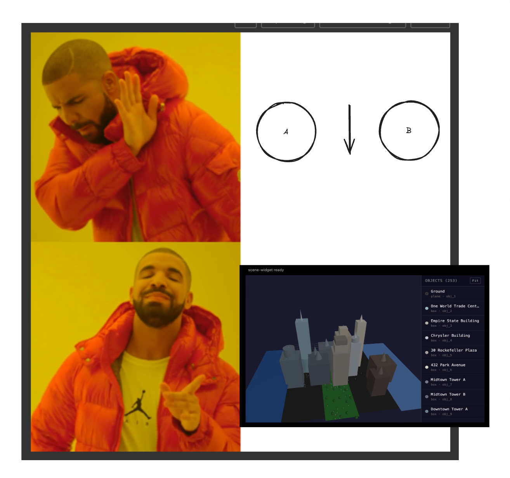

# Three.js MCP Server — Blender-style 3D Scene Builder



An MCP server that lets Claude (or any MCP client) build a 3D scene through **discrete structured tool calls** with a **proper scene graph** instead of code generation. The goal is a **persistent scene graph on the server**, Claude orchestrating it via structured tools, and a **Three.js frontend** that re-renders on state changes, rendered as an **MCP App widget** inside Claude/ChatGPT's chat UI.

---

## Architecture

| Layer | Description |
|-------|-------------|
| **AI client** | Claude/ChatGPT calls MCP tools to create and edit the scene |
| **MCP server** | Holds in-memory scene graph; exposes 7 structured tools; persists state to disk |
| **Widget** | Three.js canvas in chat UI; rebuilds from server state on every tool call |

**Design choice:** We do **not** use code generation as the primary path. All manipulation flows through structured tools and a persistent scene graph. `execute_code` is an escape hatch only.

---

## The 7 Tools

| Tool | Purpose |
|------|---------|
| **get_scene_state()** | Shows the scene widget and returns full scene JSON (all objects, positions, colors, connections). Changes from other tools are not visible until you call this. |
| **add_object(type, params)** | `type`: `"box"` \| `"sphere"` \| `"cylinder"` \| `"cone"` \| `"plane"`. `params`: `name`, `position {x,y,z}`, `scale {x,y,z}`, `color` (hex), geometry dims. Returns generated object id. |
| **update_object(id, params)** | Move / resize / recolor existing object by id; all params optional. |
| **delete_object(id)** | Remove object and its connections from scene by id. |
| **connect(from_id, face_a, to_id, face_b)** | `face`: `"top"` \| `"bottom"` \| `"left"` \| `"right"` \| `"front"` \| `"back"` \| `"center"`. Server computes offset so `face_a` of `from_id` touches `face_b` of `to_id`. LLM never deals with raw coordinates. |
| **clear_scene()** | Wipe everything; reset to empty scene. |
| **execute_code(code)** | Escape hatch: run sandboxed JS that mutates `scene` directly. Use sparingly; structured tools preferred. |

---

## Scene State Format (Server Source of Truth)

The server keeps this structure in memory and persists it to `.mcp-use/scene-state.json` across restarts. Every tool updates it and the widget always reflects the latest state after `get_scene_state` is called:

```json
{
  "objects": {
    "obj_1": {
      "type": "box",
      "id": "obj_1",
      "name": "base",
      "width": 200,
      "height": 20,
      "depth": 100,
      "position": { "x": 0, "y": 0, "z": 0 },
      "scale": { "x": 1, "y": 1, "z": 1 },
      "color": "#cc0000"
    },
    "obj_2": {
      "type": "cylinder",
      "id": "obj_2",
      "name": "post",
      "radius": 10,
      "height": 100,
      "position": { "x": 0, "y": 60, "z": 0 },
      "scale": { "x": 1, "y": 1, "z": 1 },
      "color": "#ffffff"
    }
  },
  "connections": []
}
```

---

## Widget (`resources/scene-widget.tsx`)

- Uses **`useWidget()`** to receive scene state as **props**.
- On each render, **rebuilds** the Three.js scene from `props.objects`.
- **Geometry mapping:**
  - `box` → `BoxGeometry(width, height, depth)`
  - `sphere` → `SphereGeometry(radius)`
  - `cylinder` → `CylinderGeometry(radius, radius, height)`
  - `cone` → `ConeGeometry(radius, height)`
  - `plane` → `PlaneGeometry(width, depth)` (rotated flat)
- Applies **position**, **scale**, and **color** from scene state.
- **OrbitControls** for rotate/zoom.
- **Sidebar** listing all objects (name, type, id) with click-to-select highlight.
- **Connections:** draws a line between connected objects.
- **Auto-fits** camera to scene bounds when objects are first added.

---

## Stack

- **MCP server:** Node.js / TypeScript (`index.ts`), [mcp-use/server](https://mcp-use.com/docs/typescript/getting-started/quickstart)
- **Widget:** React + Three.js in `resources/scene-widget.tsx`
- **State:** In-memory scene graph + persisted to `.mcp-use/scene-state.json`
- **Build:** Vite + vite-plugin-singlefile
- **Host:** Rendered as mcp-use widget in Claude/ChatGPT chat UI

---

## Acceptance Test

Run in sequence:

1. `add_object("box", { name: "base", width: 200, height: 20, depth: 100, color: "#cc0000" })`
2. `add_object("cylinder", { name: "post", radius: 10, height: 100, color: "#ffffff" })`
3. `connect("obj_2", "bottom", "obj_1", "top")`
4. `update_object("obj_1", { color: "#0000cc" })`
5. `get_scene_state()`

**Expected:** Blue flat box with white cylinder standing on top, rotatable in chat.

---

## Getting Started (Local Dev)

```bash
npm install
npm run dev
```

Open [http://localhost:3000/inspector](http://localhost:3000/inspector) to test the server. The server auto-reloads as you edit `index.ts`.

## Deploy on Manufact Cloud

```bash
npm run deploy
```

---

## Learn More

- [mcp-use Documentation](https://mcp-use.com/docs/typescript/getting-started/quickstart)
- [MCP Apps Hackathon 2026 context](./docs/mcp-apps-hackathon-2026-master-context.md) (evaluation criteria, widget–model interaction)
